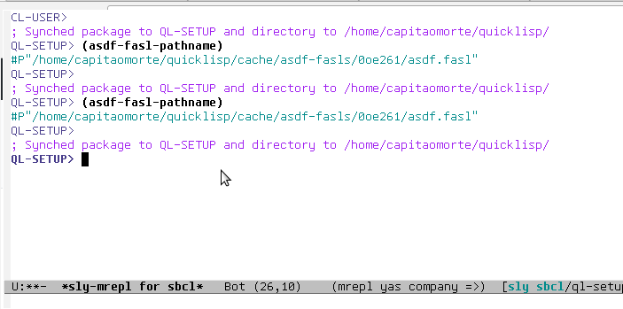
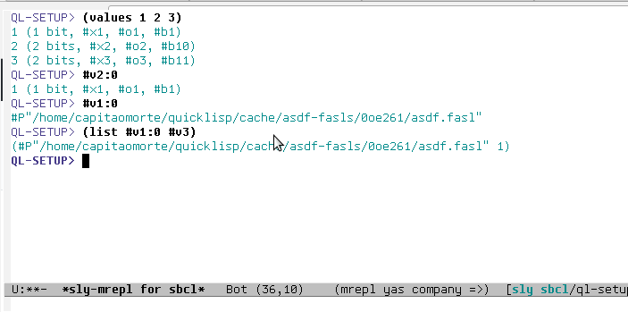
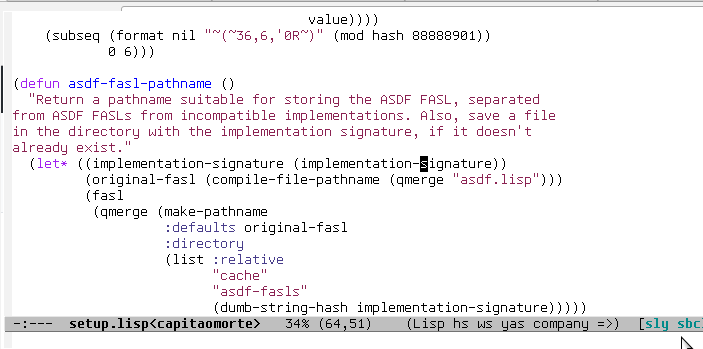

[](https://travis-ci.org/joaotavora/sly)
[](http://melpa.org/#/sly)

```lisp
          _____    __   __  __        
         / ___/   / /   \ \/ /               |\      _,,,---,,_
         \__ \   / /     \  /                /,`.-'`'    -.  ;-;;,_
        ___/ /  / /___   / /                |,4-  ) )-,_..;\ (  `'-'
       /____/  /_____/  /_/                '---''(_/--'  `-'\_)

```

SLY is Sylvester the Cat's Common Lisp IDE for Emacs:

* 🤔 Read [a short illustrated guide][tutorial]
* 📽️ Scroll down this README for some [pretty gifs](#animated_gifs)
* 📣 Read the [NEWS][6] file
* 📚 Read the [manual][documentation]

SLY is a fork of [SLIME][1] and contains the following improvements upon
it:

* Completely [redesigned REPL](#repl) based on Emacs's own full-featured
  `comint.el`;
* [Live code annotations](#stickers) via a new `sly-stickers` contrib;
* Consistent interactive button interface.  Everything can be copied to the
  REPL;
* Modern [flex-style completion](#company-flex-completion).  Much snappier when
  using [company][14], and no plugin required;
* Cleanly ASDF-loaded by default, including contribs, which are enabled
  out-of-the-box;
* Multiple inspectors;
* Support for [NAMED-READTABLES][11], [macrostep.el][12] and [quicklisp][13]

SLY tracks SLIME's bugfixes.  All its familar features (debugger, inspector,
xref, etc...) are still available, with improved overall UX.

Installation
------------

Ensure that [MELPA][10] is setup as usual and ask `M-x package-install` to
install the package `sly`.

*That's it*. `sly-mode` will automatically come up in every `.lisp` file. To
fire up SLY, connect to a Lisp and get a friendly REPL, use `M-x sly`.

Even if you already have SLIME installed, SLY will ask you and temporarily
disable it for the Emacs session.

<a name="animated_gifs"></a>
_Obligatory animated gif section_
-----------------------------------

<a name="company-flex-completion"></a>
[Flex completion](http://joaotavora.github.io/sly/#Completion)


<a name="repl"></a>
[Backreferences](http://joaotavora.github.io/sly/#REPL-backreferences)



[Reverse i-search](http://joaotavora.github.io/sly/#REPL-commands)



<a name="stickers"></a>
[Stickers](http://joaotavora.github.io/sly/#Stickers)



Install from git
-------------------

Clone this repository, add this to your `~/.emacs` file and fill in the
appropriate file names:

```el
(add-to-list 'load-path "~/dir/to/cloned/sly")
(require 'sly-autoloads)
(setq inferior-lisp-program "/opt/sbcl/bin/sbcl")
```

If you wish to byte-compile SLY yourself (not needed generally) you can do `make
compile compile-contrib` in the dir where you cloned SLY.

Running the server standalone
-----------------------------

This also works
```
$ sbcl
...
* (push #p"~/dir/to/sly" asdf:*central-registry*)
* (asdf:load-system :slynk)
* (slynk:create-server :port 4008)
```

Now in Emacs you can do `sly-connect` and give it the host and the 4008 port as
a destination.

Instant REPL startup
--------------------

To dramatically increase the startup time of the REPL, [Lisp REPL core
dumper](https://gitlab.com/ambrevar/lisp-repl-core-dumper) can generate
preloaded executable images on demand.  See the official website for the Emacs
setup.

Additional Contribs
-------------------

* https://github.com/joaotavora/sly-quicklisp
* https://github.com/joaotavora/sly-named-readtables
* https://github.com/joaotavora/sly-macrostep
* https://github.com/joaotavora/sly-stepper
* https://github.com/mmgeorge/sly-asdf
* https://github.com/40ants/sly-package-inferred

Completion UIs
--------------

SLY works with most Emacs "completion UIs" out of the box, providing completion
in source files and inputting Common Lisp symbol names from the minibuffer.
[Company][14], Emacs 27's Fido-mode, and Helm are well-supported, as is
"vanilla" completion.  For consistency, SLY defaults to its own UI,
`sly-symbol-completion-mode`, useful if you don't have or like any of those.
You can turn it off.  Also, if you use Helm and wish to have even more
Helm-based fanciness, you can use [helm-sly][15].

License
-------

SLY is free software. All files, unless explicitly stated otherwise, are public
domain.  ASCII artwork is copyright by Felix Lee, Joan G. Stark and Hayley Jane
Wakenshaw.

Fork
----

SLIME is the work of Eric Marsden, Luke Gorrie, Helmut Eller, Tobias
C. Rittweiler and [many others][8]. I forked SLIME because I used it daily,
for work, had a long list of hacks developed for myself, and wanted to share
them with others.

In 2013, SLIME development was stalling, patches and issues rotting. In early 
2014,  Luís Oliveira and myself moved SLIME to Github and set up its Travis CI 
system. I brought in the old bug reports from the Launchpad tracker, fixed 
long-standing problems and submitted many changes, particularly to the 
under-curated but popular "contrib" section.

Now, the changes that SLY brings to the table are too deep at the Elisp and Lisp
level to be accepted to SLIME, given its current focus on stability (for the
record, I find this perfectly reasonable). The new features, such as stickers or
multiple inspectors, cannot be realized well using only the existing "contrib"
system.  Finally, SLY frees itself from the shackles of Emacs 23 and supports
Emacs 24.3+ only, allowing for much cleaner code and liberal use of lexical
binding.

The list of technical reasons is bigger than this though, and you can read up on
them in the [CONTRIBUTING.md][9] file.

Contributing
------------

[Open an issue or a pull request][4], but at least have a quick look at the
first part [CONTRIBUTING.md][5] file for instructions on how to contribute.

[1]: http://www.common-lisp.net/project/slime/
[2]: https://github.com/joaotavora/sly/blob/master/README.md#fork
[4]: https://github.com/joaotavora/sly/issues
[5]: https://github.com/joaotavora/sly/blob/master/CONTRIBUTING.md
[6]: https://github.com/joaotavora/sly/blob/master/NEWS.md
[7]: https://www.youtube.com/watch?v=xqWkVvubnSI
[8]: http://common-lisp.net/project/slime/doc/html/Credits.html#Credits
[9]: https://github.com/joaotavora/sly/blob/master/CONTRIBUTING.md#architecture
[10]: https://github.com/milkypostman/melpa
[11]: https://github.com/joaotavora/sly-named-readtables
[12]: https://github.com/joaotavora/sly-macrostep
[13]: https://github.com/joaotavora/sly-quicklisp
[14]: https://github.com/company-mode/company-mode
[15]: https://github.com/emacs-helm/helm-sly
[documentation]: http://joaotavora.github.io/sly
[tutorial]: http://joaotavora.github.io/sly/#A-SLY-tour-for-SLIME-users

<!-- Local Variables: -->
<!-- fill-column: 80 -->
<!-- End: -->
